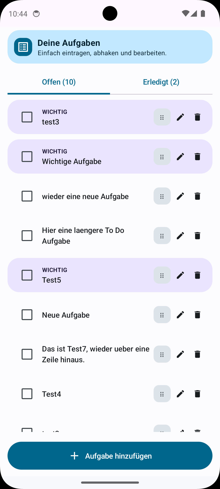
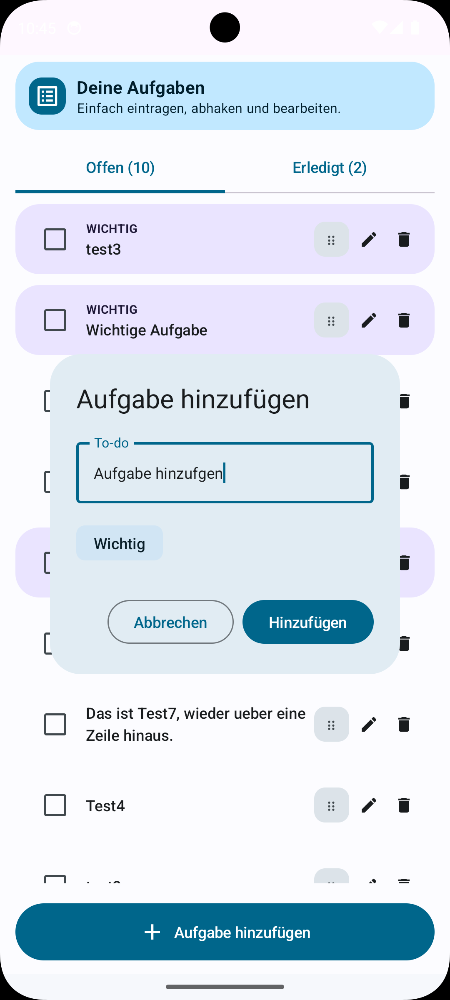
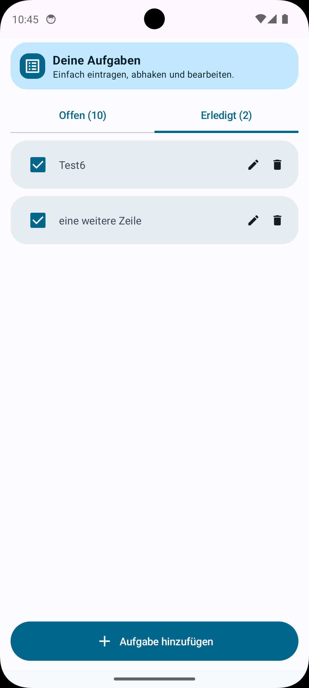
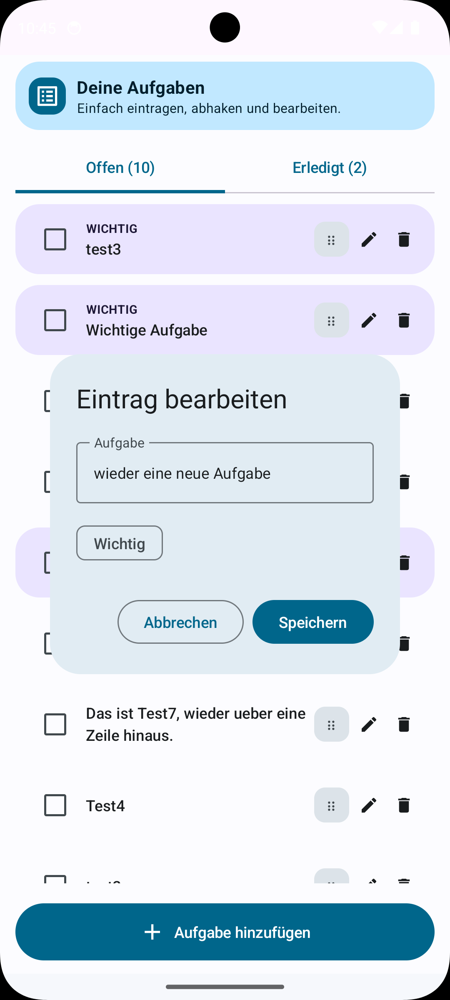

# simpleToDo

Eine einfache To-do-App auf Deutsch für Android.

## Funktionen
- Aufgaben hinzufügen
- per Checkbox als erledigt markieren
- Einträge bearbeiten
- wichtige Aufgaben markieren
- Aufgaben per Drag&Drop sortieren
- offene und erledigte Aufgaben in getrennten Registerkarten
- hübsches, aufgeräumtes Material-Design
- lokale Speicherung auf dem Gerät

## Download
Die aktuelle APK findest du hier:

- [simpleToDo-release.apk](https://github.com/seb-labs/simpleToDo/releases/latest/download/simpleToDo-release.apk)

## Screenshots

<p align="center">
  
  
</p>

<p align="center">
  
  
</p>

## Build
```bash
./gradlew assembleDebug
```

## Hinweis
Die App ist absichtlich einfach gehalten und speichert alles lokal.

## Kontakt
`simpleToDo@seblabs.unbox.at`
